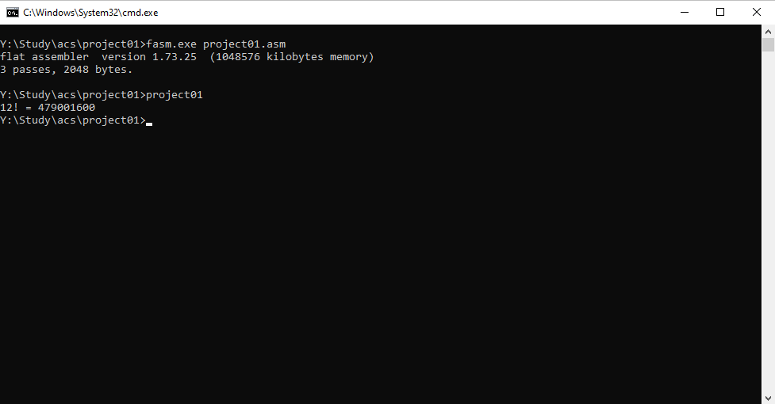

# Мини-проект №1

Вариант 28

Щербаков Дмитрий Александрович

## Задание

Разработать программу, определяющее максимум параметра функции факториала, при котором значение функции не превышает 10^9

## Пояснительная записка

Программа выполняется и компилируется на операционной системе Windows с компилятором FASM для 32-разрядных систем.

### Применяемые расчетные методы

Для расчета факториала числа используется команда процессора `mul`, которая помещает в регистр `eax` результат произведения числа из `eax` и переданного аргумента.

Для реализации цикла используются метка `loop0`, обозначающая начало цикла. В цикле мы выполняем инкремент регистра `ebx` и умножаем число в регистре `eax` на `ebx`. Полученный результат мы выводим с помощью функции `printf` в формате `%d! = %d`. Для вычисления факториала, не превышающего 10^9 нам достаточно обычных целочисленных 32-битных регистров.

### Скриншот работы программы


### Код программы
```
format PE console
entry start

include 'INCLUDE\MACRO\import32.inc'
include 'INCLUDE\MACRO\proc32.inc'

section '.data' data readable
        strPrintInt db '%d! = %d', 0

section '.code' code readable executable
start: ; просто считаем факториал в регистрах
        mov ebx, 1
        mov eax, 1 ; eax = ebx!

        loop0:
                mov ecx, eax ; ecx = (ebx - 1)!
                add ebx, 1
                mul ebx
                cmp eax, 1000000000
                jle loop0

        sub ebx, 1 ; ebx! = ecx
        push ecx
        push ebx
        push strPrintInt
        call [printf] ; printf("%d! = %d", ecx, ebx - 1)
        add ebp, 8

        push 0
        call [exit]

section '.idata' import data readable
    library msvcrt, 'msvcrt.dll'
    import msvcrt,\
           printf, 'printf',\
           exit, 'exit'
```

## Список источников

[1] Flat Assembler \[Электронный ресурс\] // https://flatassembler.net/index.php