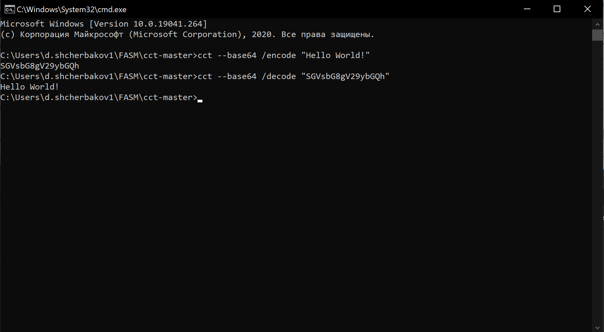
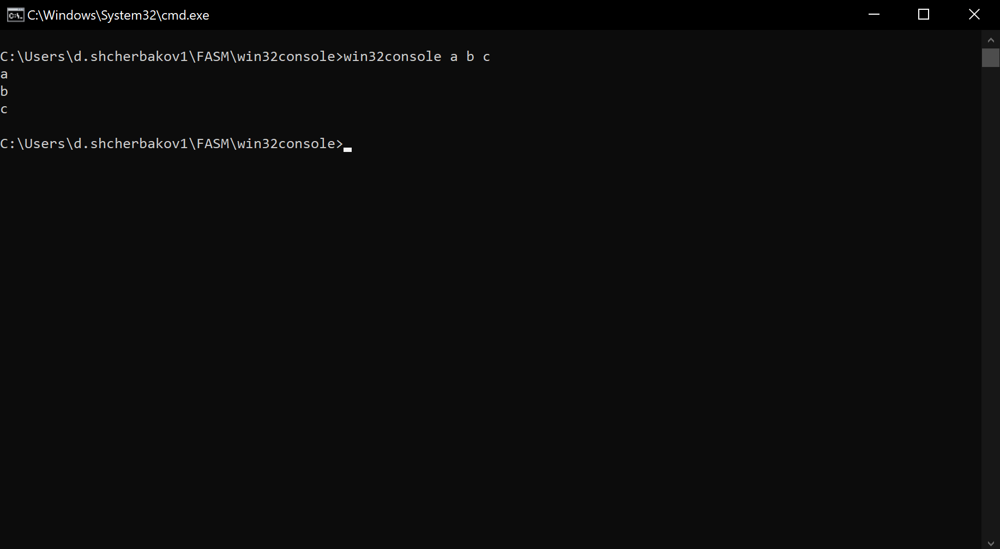
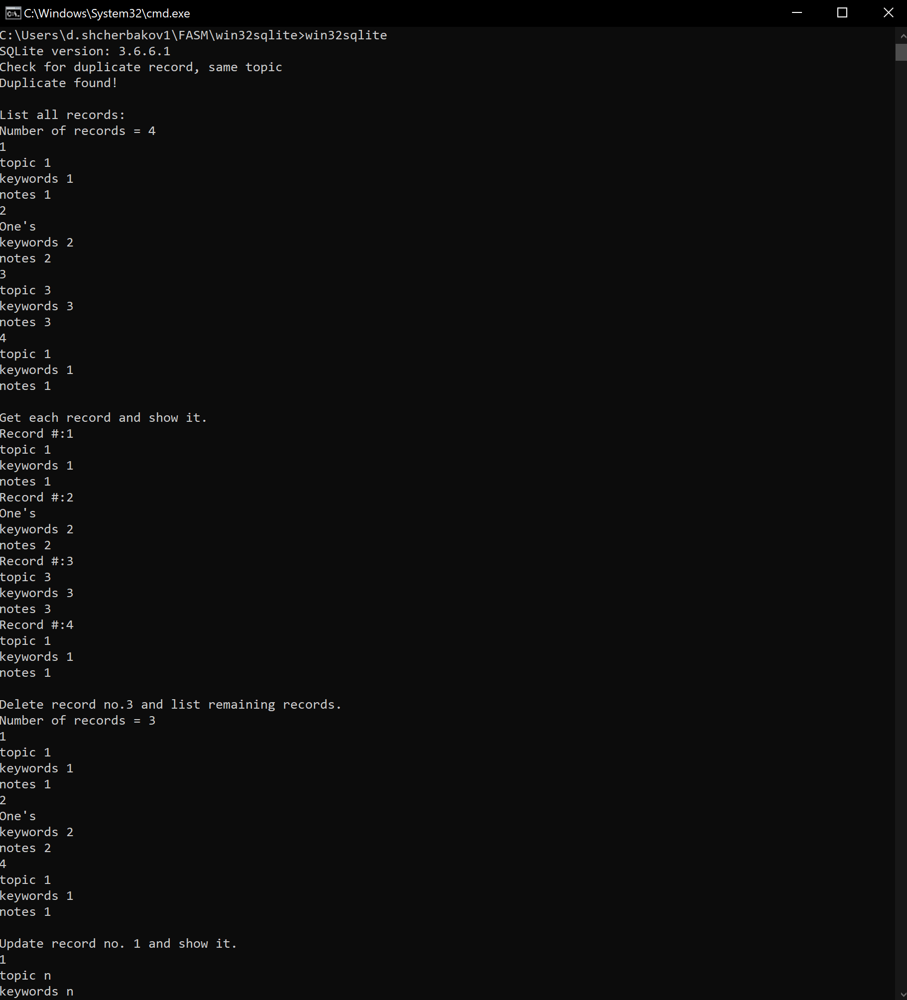
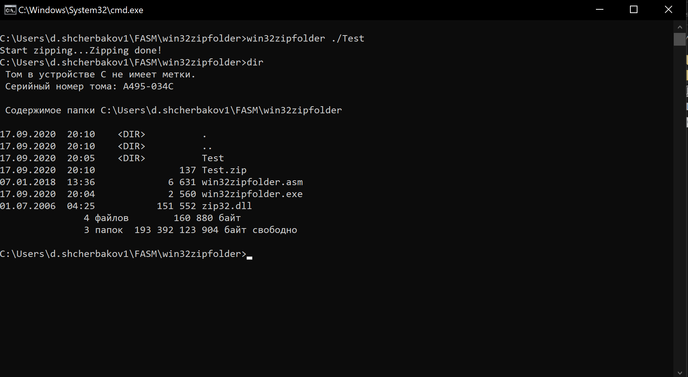

# Домашняя работа №1 по АВС

* Найти в различных источниках информации не менее пяти
примеров консольных программ разной сложности, написанных
на изучаемом Ассемблере.
* Откомпилировать и запустить их с различными тестовыми
наборами данных.

### Console Command Tool
[Исходный код](https://github.com/jar0l/cct)

Самая сложная программа, которую удалось найти. Представляет собой набор утилит, таких как:

* Математические функции (min, max, log, cos и т.д.)
* Выполнение программ и скриптов (js, vbs, swf, web-browser, exec, shell и т.д.)
* Утилиты для кодирования и декодирования (base64, md5, sha1, sha256 и т.д.)
* regexp
* text-to-speech

И множество других утилит для работы с файлами, системой, окнами.

Все они запускаются через консоль, например:
```
cct --save /title "Save file" /filter "Image files|*.bmp;*.jpg;*.png;*.gif|All files|*.*|"
```
```
cct --base64 /encode "Hello World!"
cct --base64 /decode "SGVsbG8gV29ybGQh"
```



### bf-interpreter-fasm
[Исходный код](https://github.com/gimadutdin/bf-interpreter-fasm)

Интерпретатор языка Brainfuck, написанный на FASM


Следующие примеры программ имеют менее утилитарное назначение, они скорее предназначены для обучения.
Все программы взяты из https://github.com/yeohhs/win32fasm. Могут потребоваться сторонние библиотеки.

### win32console
[Исходный код](./code/win32console/win32console.asm)

Выводит в консоль аргументы из командной строки (до трех штук)



### win32sqlite
[Исходный код](./code/win32sqlite/win32sqlite.asm)

Выполняет какой-то SQL-скрипт на базе данных sqlite и выводит шаги в консоль



### win32zipfolder
[Исходный код](./code/win32zipfolder/win32zipfolder.asm)

Сжимает папку в zip-архив

