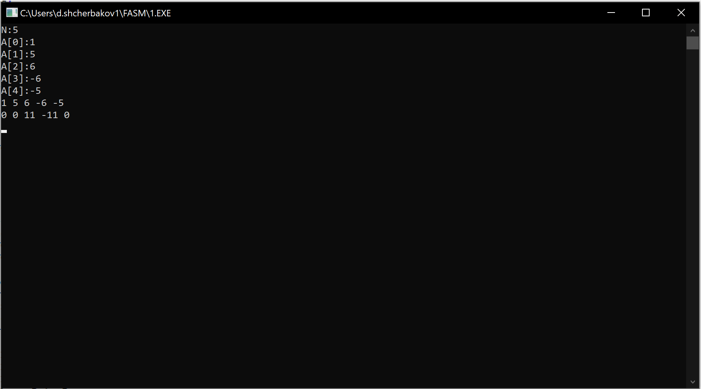
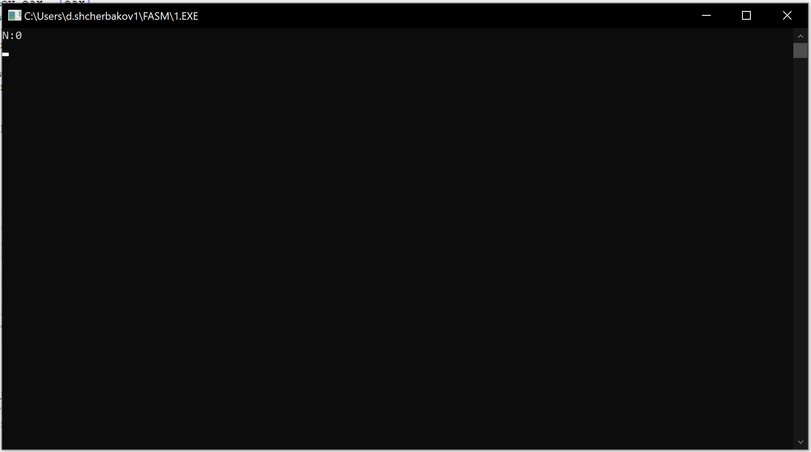
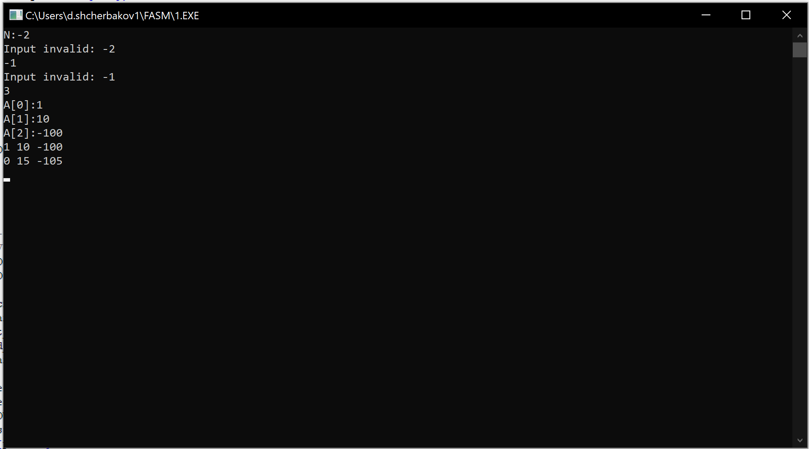
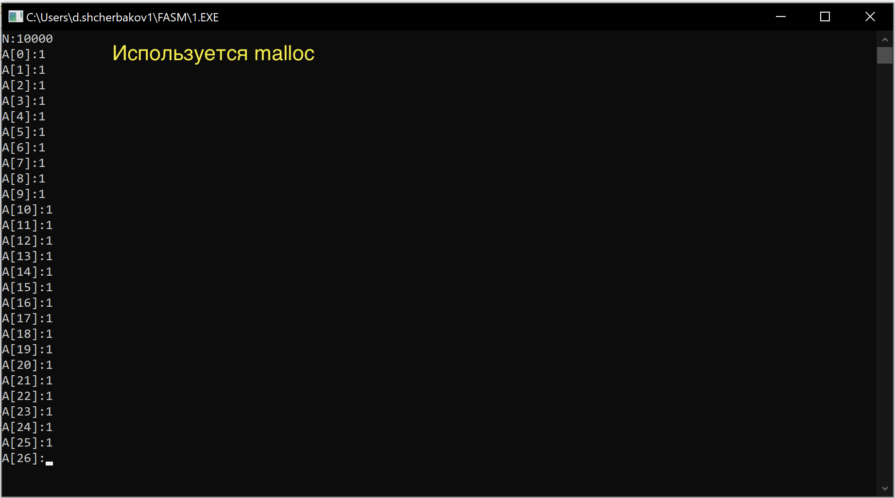

# Домашнее задание №2
[Код программы](./task02.asm)

## Условие 
Разработать программу, которая вводит одномерный массив A[N], формирует из элементов массива A новый массив B по правилам, указанным в таблице, и выводит его. Память под массивы может выделяться как статически, так и динамически по выбору разработчика.
Разбить решение задачи на функции следующим образом:
- Ввод и вывод массивов оформить как подпрограммы.
- Выполнение задания по варианту оформить как процедуру
- Организовать вывод как исходного, так и сформированного массивов
Указанные процедуры могут использовать данные напрямую (имитация процедур без параметров). Имитация работы с параметрами также допустима.
Массив B из элементов B[i]=A+5, если A[i]>5; B[i]=A-5, если A[i]<5; B[i]=0, иначе

## Скриншоты

- Программа работает на правильных данных

- Программа допускает массивы нулевой длины

- Программа **не** допускает массивы нулевой длины

- Программа использует динамическое выделение памяти
